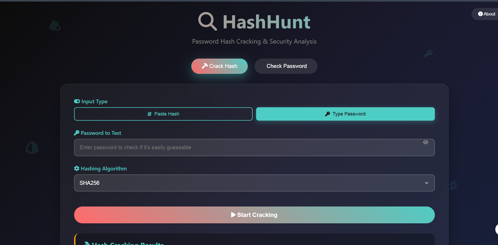
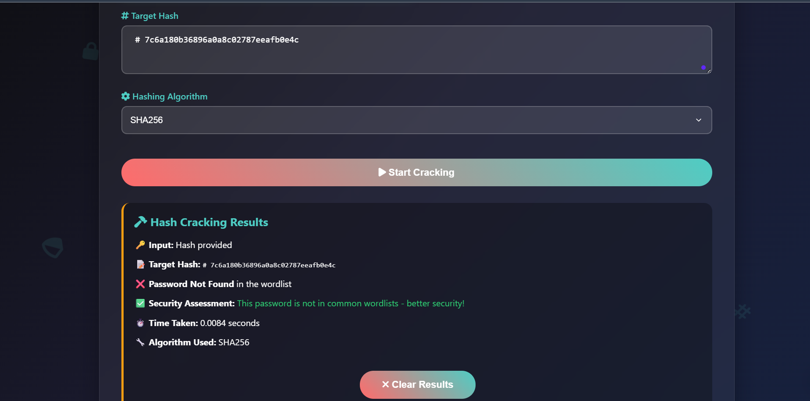
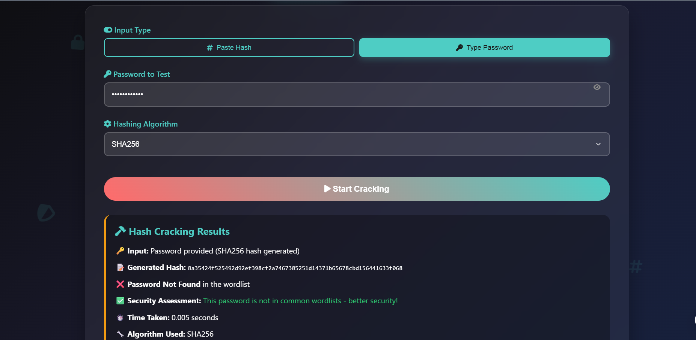
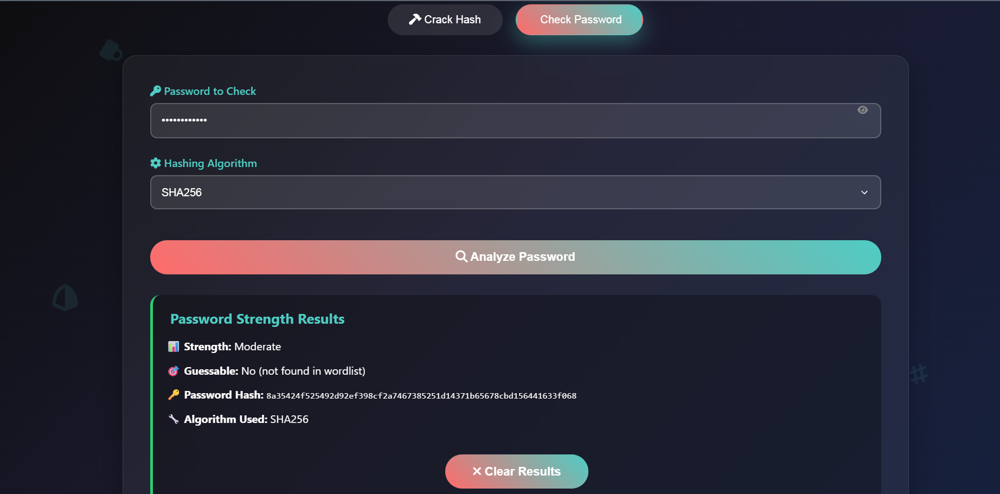

# 🔐 HashHunt

**HashHunt** is a beginner-friendly password hash cracker built to demonstrate how dictionary attacks work. It allows you to crack hashed passwords, analyze password strength, and test password guessability using a wordlist. Designed for students, developers, and cybersecurity learners.

> ⚠️ For educational use only. Do not use this tool against systems you don’t own or have permission to test.

---

## 🚀 Features

- 🔍 Crack hashed passwords using a dictionary attack  
- 🧪 Analyze password strength (length, complexity, and guessability)  
- 🧰 Multi-algorithm support: `SHA256`, `MD5`, `SHA1`  
- 🖥️ CLI and Web UI (Flask-based)  
- 🧠 Real-time feedback with password testing  
- 🌐 Responsive web UI with floating icons and dynamic forms

---

## 🖼️ Demo

  
  
  


---

## 🧱 Tech Stack

- Python 3  
- Flask  
- HTML, CSS (custom + FontAwesome)  
- JavaScript (for dynamic behavior)  
- tqdm (for CLI progress bar)  
- Gunicorn (for production-ready server)

---

## 📁 Project Structure

```

hashhunt/
├── backend/
│   └── cracker.py              # Core logic for cracking & strength analysis
├── static/
│   └── styles.css              # Styling for the frontend
├── templates/
│   └── index.html              # Web UI layout
├── app.py                      # Flask backend
├── main.py                     # CLI interface
├── wordlist.txt                # Common password wordlist
└── README.md                   # You’re reading it!

````

---

## ⚙️ Setup Instructions

### 🔧 Local Setup (for educational/testing purposes)

1. **Clone this repo:**

   ```bash
   git clone https://github.com/khushii-05/hashhunt.git
   cd hashhunt

2. **Install dependencies:**

   ```bash
   pip install -r requirements.txt
   ```

3. **Run the app locally:**

   ```bash
   python app.py
   ```

4. Open `http://localhost:5000` in your browser.

---

## 📦 Run via CLI

You can also use the command-line interface:

```bash
python main.py --hash <HASH> --wordlist wordlist.txt --algo sha256
```

Or test password strength:

```bash
python main.py --check-password <your-password> --wordlist wordlist.txt --algo sha256
```

---

## 🌐 Hosted Version

A hosted version of this project is available for demo purposes only.
This project is not intended to be redeployed or reused as-is.

If you're exploring or learning from the code, you're welcome to fork and study —
but please refrain from cloning and deploying it directly as a public tool.

---

## 🧠 Credits

Built by **Khushi Tiwari** as a learning project.
Feel free to fork, improve, and learn from it!

```


